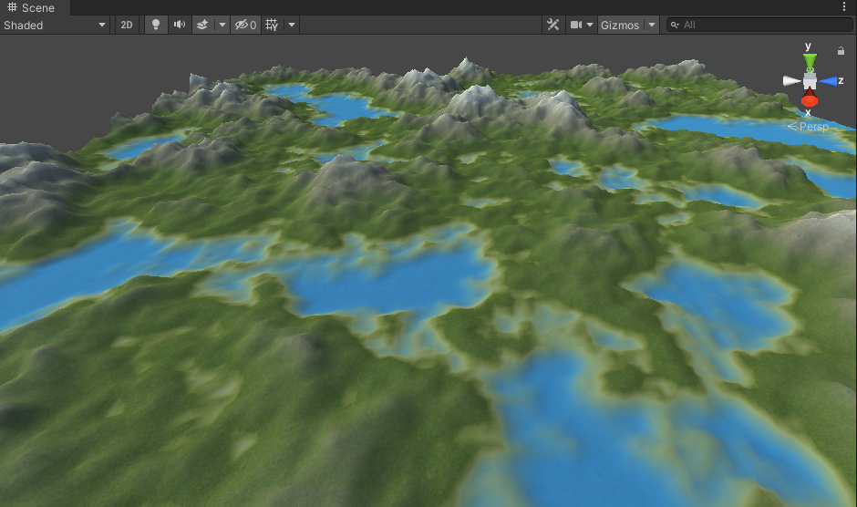

# World Generator
Code base to procedurally generate 3D world in Unity.
Generated world is pseudoinfinite and use multithreading to don't interrupt player experience.

Furthermore provide necessary tools to adjust world settings and save it for future use.

## Description

