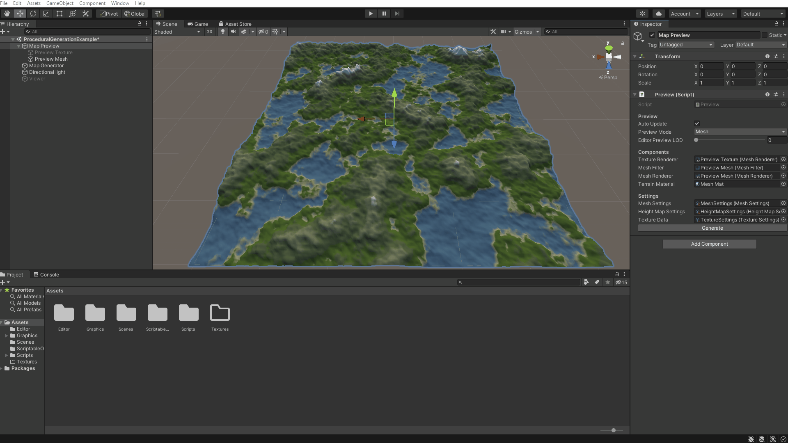
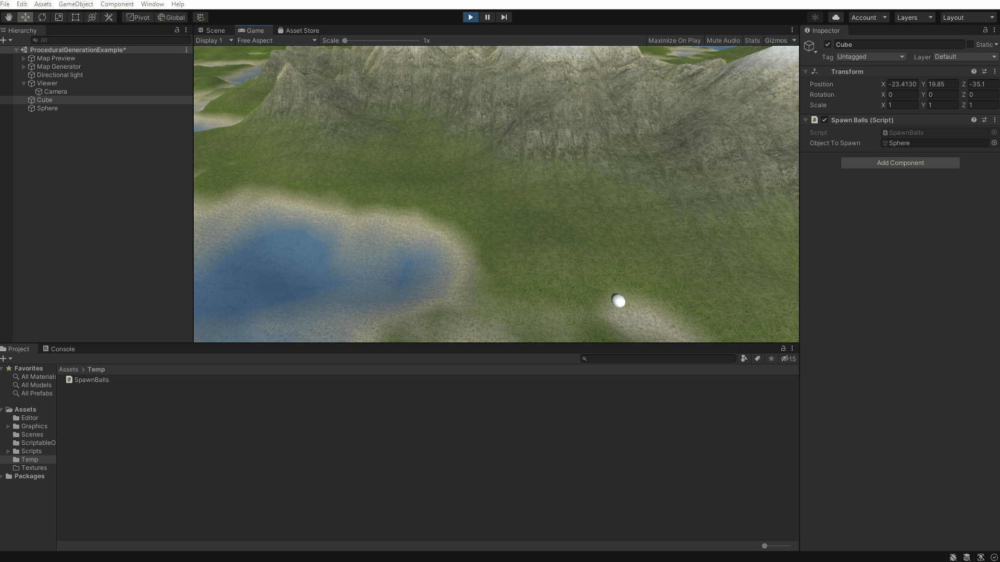
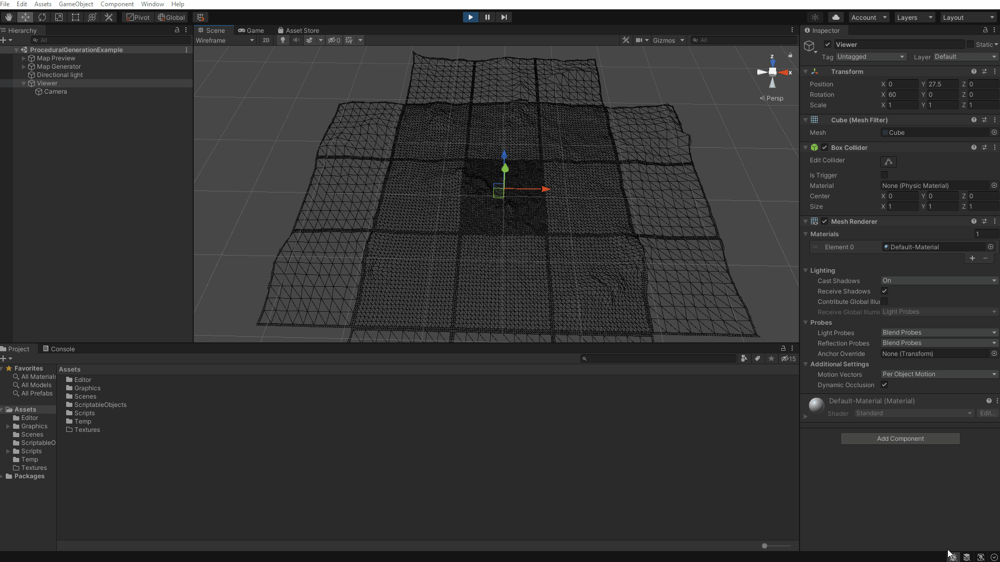

# World Generator
Code base to procedurally generate 3D world in Unity.
Generated world is pseudoinfinite and use multithreading to don't interrupt player experience.

Furthermore provide necessary tools to adjust world settings and save it for future use.

# Main features
  - [Preview mode](#Preview-mode)
  - [Height map settings](#Height-map-settings)
  - [Mesh settings](#Mesh-settings)
  - [Texture settings](#Texture-settings)
  - [Infinite](#Infinite)
  - [Collisions](#Collisions)
  - [Level of detail settings](#Level-of-detail-settings)
  - [Multithreaded](#Multithreaded)
  - [Falloff map](#Falloff-map)
  - [Object placement](#Object-placement)
  - [Installation](#Installation)

## Preview mode
Preview mode allow to peek how generated world will look like. You can peek at mesh or height map.

## Height map settings 
Possibility to change all parameters related to height map.

## Mesh settings
Possibility to change all parameters related to mesh.

## Texture settings
Possibility to use custom textures and adjust them.

## Infinite
Terrain in generated on demand as player is moving.

## Collisions
Collisions based on mesh collider.

## Level of detail
Level of detail changed chunks based on distance from player.

## Multithreaded
Mesh generation is done on separate thread to do not interrupt gameplay.

## Falloff map

## Object placement

## Installation
* Require Unity 2020.3.2f1 (or higher). Should work on older versions too.
* Fork this repository and use example scene.
