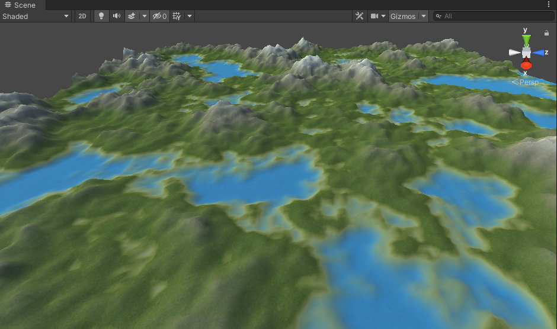
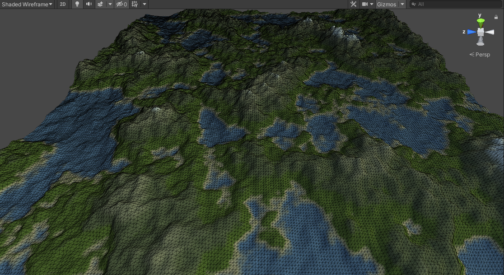
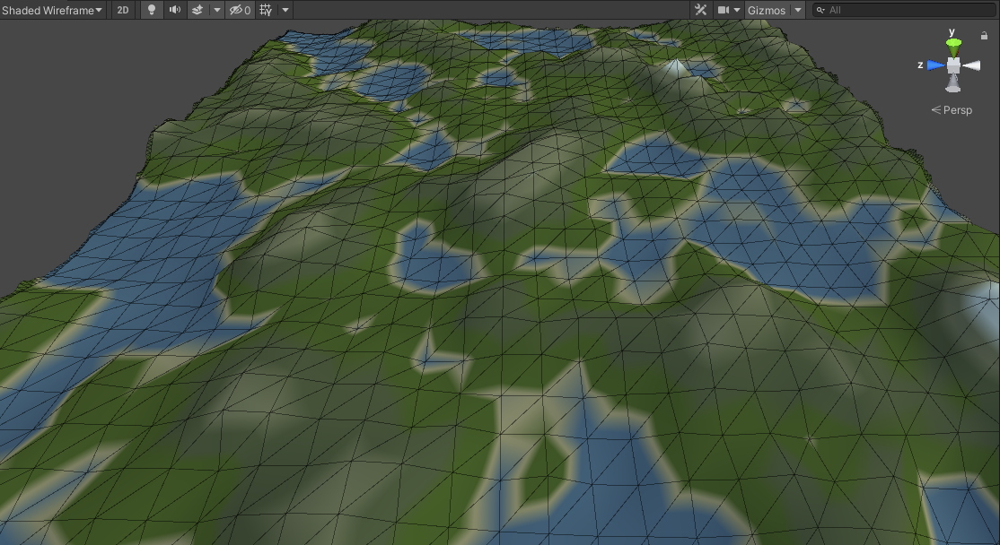

# World Generator
Code base to procedurally generate 3D world in Unity.
Generated world is pseudoinfinite and use multithreading to don't interrupt player experience.

Furthermore provide necessary tools to adjust world settings and save it for future use.

# Main features
  - [Preview mode](#Preview-mode)
  - [Custom settings](#Custom-settings)
  - [Infinite](#Infinite)
  - [Support physics system](#Support-physics-system)
  - [Level of detail settings](#Level-of-detail-settings)
  - [Multithreaded](#Multithreaded)
  - [Falloff map support](#Falloff-map-support)
  - [Procedural object placement](#Procedural-object-placement)
  - [Installation](#Installation)

## Preview mode

## Custom settings

##Infinite

##Support physics system

##Level of detail settings
Two different LOD settings on the same chunk of terrain.
| Max         | Min |
|----------------|---------------|
|   | 

## Multithreaded

## Falloff map support

## Procedural object placement

## Level of detail

## Installation
* Require Unity 2020.3.2f1 (or higher). Should work on older versions too.
* Fork this repository and use example scene.
